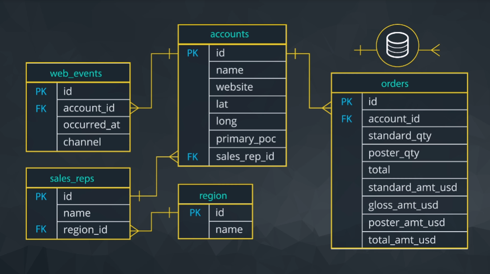
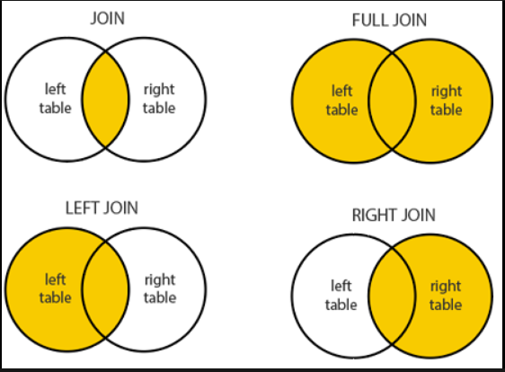

# My 60 days Journey of Learning Structured Query Language For Data Analysis

| Resources | Description |
| ----------- | ----------- |
|SimpleLearn| https://lms.simplilearn.com/courses/4309/Introduction-to-SQL/syllabus|
|Udacity|https://www.udacity.com/course/sql-for-data-analysis--ud198|
|SqlBolt|https://sqlbolt.com/|
|W3School|https://www.w3schools.com/sql/|

| Day | Description |
| ----------- | ----------- |
|1 - 6| Basic SQL|

## Day 1 of 60days
- During my SQL learning journey, Today I learn about the basic introduction and Different Database language.
- Introduction : SQL (Structured Query Language) is a standard programming language designed for managing and manipulating relational databases. It provides a set of commands and syntax for performing various operations on data stored in a database.
- SQL plays a crucial role in data analysis by providing powerful tools to retrieve, filter, aggregate, and manipulate data stored in relational databases.

| SQL | Description |Commands|
| ----------- | ----------- |-----------|
|Data Definition Language (DDL)|DDL commands are used to define and manage the structure of the database, including tables, views, indexes, and constraints.| CREATE, ALTER, DROP, TRUNCATE, RENAME.|
|Data Manipulation Language (DML)|DML commands are used to manipulate and retrieve data within the database.|SELECT, INSERT, UPDATE, DELETE.|
|Data Control Language (DCL)|DCL commands are used to manage user access and control database privileges.|GRANT, REVOKE|
|Transaction Control Language (TCL)|TCL commands are used to manage transactions within the database. A transaction is a sequence of database operations that should be treated as a single unit.|COMMIT, ROLLBACK, SAVEPOINT.|

## Day 2 of 60days
- During my SQL learning journey, Today I learn about the Entity Relationship Diagrams and Different type of Keys.
- An Entity-Relationship Diagram (ERD) is a visual representation that depicts the entities (objects) in a database, their attributes, and the relationships between them. It helps in designing and understanding the structure of a database

| Keys | Description |
| ----------- | ----------- |
|Primary Key (PK)|A primary key is a unique identifier for each record in a table.|
|Foreign Key (FK)|A foreign key is a column or a set of columns in a table that refers to the primary key of another table.It establishes a relationship between two tables, enforcing referential integrity|
|Composite Key|A composite key consists of two or more columns that, together, uniquely identify a record in a table|
|Candidate Key|A candidate key is a column or a set of columns that can uniquely identify a record in a table|
|Unique Key|A unique key ensures that the values in the column(s) are unique and not duplicated within a table|
|Alternate Key|An alternate key is a candidate key that was not selected as the primary key.|

## Day 3 of 60days
- During my SQL learning journey, Today I learn about the Data Definition languages and it's commands.
- Learned about how to create tables and different data types that are available to create tables and define the attributes of columns.
- DataTypes 
  - INTEGER:signed four-byte integer
  - VARCHAR(n):variable-length character string with maximum length 'n'
  - TEXT:variable-length character string without any length limit
  - CHAR(n):fixed-length character string with length 'n'

| SQL Commands| Description |
| ----------- | ----------- |
|CREATE|This command is used to create the database or its objects (like table, index, function, views, store procedure, and triggers)|
|ALTER|This is used to alter the structure of the database.|
|DROP|This command is used to delete objects from the database.|
|TRUNCATE|This is used to remove all records from a table, including all spaces allocated for the records are removed.|

## Day 4 of 60days
- During my SQL learning journey, Today I learn about the Data Manipulation languages and it's commands.

| SQL Commands| Description |
| ----------- | ----------- |
|SELECT|Retrieves data from one or more tables based on specified conditions|
|INSERT|Inserts new data into a table.|
|DELETE|Deletes data from a table based on specified conditions.|
|UPDATE|Modifies existing data in a table.|

## Day 5 of 60days

- During my SQL learning journey,I learn about different SQL Clauses.Here I learn about LIMIT, ORDER BY 

| SQL Clauses| Description |
| ----------- | ----------- |
|LIMIT|The LIMIT clause is used to restrict the number of rows returned by a SELECT statement|
|ORDER BY|The ORDER BY statement allows us to sort our results using the data in any column.|
|WHERE|Help to filter the data under specified condition.|

## Day 6 of 60days
- During my SQL learning journey,Today I learn about using WHERE statement with non-numeric data.We can use the = and != operators here. You need to be sure to use single quotes with the text data, not double quotes.

- Commonly when we are using WHERE with non-numeric data fields, we use the AND and BETWEEN,LIKE, NOT, or IN operators.

- I learn about different operators like Arthmetic,Logical and Comparison that can be use with WHERE clause

| Operator| Sign |
| ----------- | ----------- |
|Arithmetric|+, -, /, *|
|Logical| OR, AND, NOT|
|Comparision|=, <= ,>= ,!=|

## Day 7 of 60days
- During my SQL learning journey,Today I learn theortical concept about Joins in SQL. JOINs are useful for allowing us to pull data from multiple tables. This is both simple and powerful all at the same time.
- There are 4 types of JOIN commonly use in SQL

| JOINS|Description |
| ----------- | ----------- |
|INNER JOIN|Returns only the matching rows between the tables.|
|FULL JOIN|Returns all rows from both tables. If there is no match, NULL values are returned for the columns that do not have a matching row.|
|LEFT JOIN |Returns all rows from the left table and the matching rows from the right table. If there is no match, NULL values are returned for the right table columns.|
|RIGHT JOIN|Returns all rows from the right table and the matching rows from the left table. If there is no match, NULL values are returned for the left table columns.|

## Day 8 of 60days
- During my SQL learning journey,Today I learn about Primary KEY and Foreign KEY.
- Primary Key(PK)
  - A primary key is a unique column in a particular table. This is the first column in each of our tables. Here, those columns are all called id, but that doesn't necessarily have to be the name. It is common that the primary key is the first column in our tables in most databases.

- Foreign Key(FK)
  - A foreign key is a column in one table that is a primary key in a different table.

- Primary - Foreign Key Link
  - The region_id is the foreign key.
  - The region_id is linked to id - this is the primary-foreign key link that connects these two tables.
  - The crow's foot shows that the FK can actually appear in many rows in the sales_reps table.
  - While the single line is telling us that the PK shows that id appears only once per row in this table.

