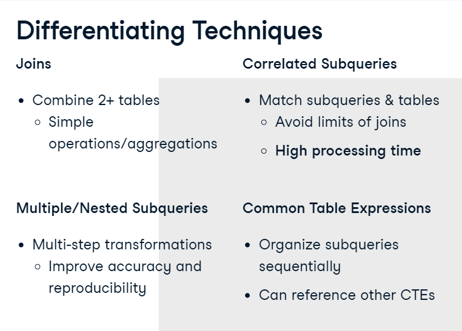
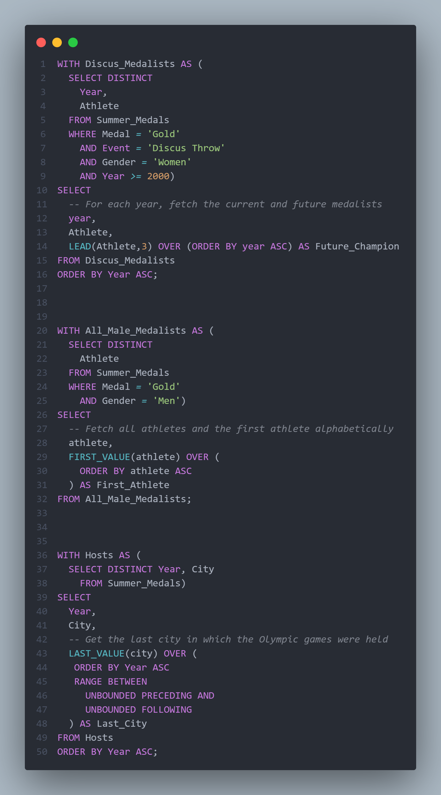
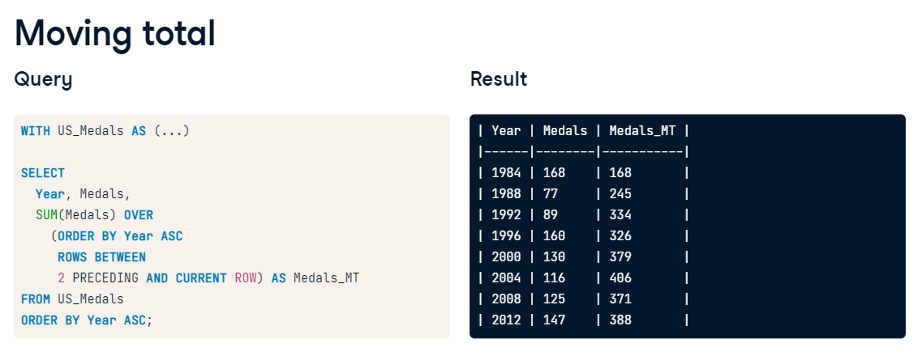
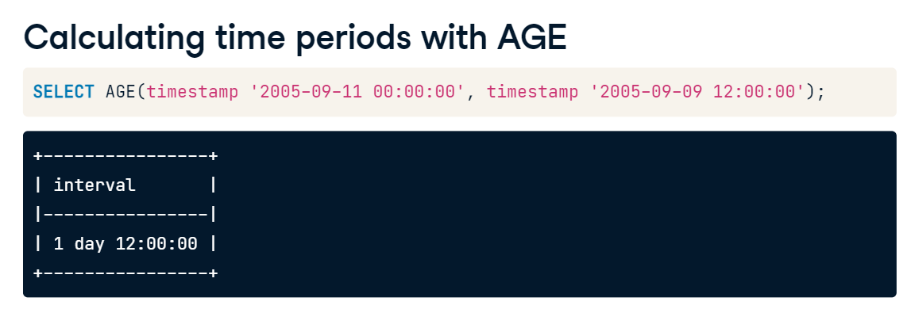
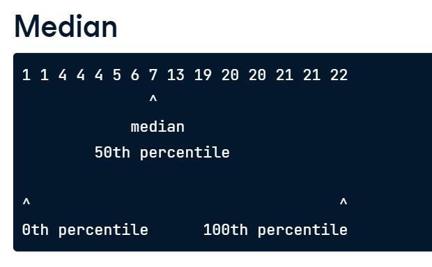
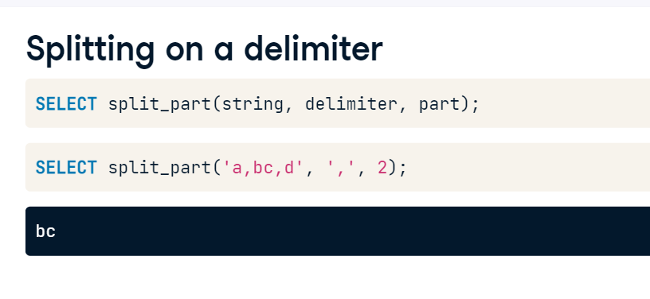

# 📚🗓️ Welcome to "60 Days of Learning SQL" For Data Analysis! 🤓📊

- In this Git repo, I'll embark on a SQL learning adventure 🚀💻 to become a SQL master 🎓🔍. Over the next 60 days, I'll dive into the world of databases, queries, and data manipulation! 🌐💽

- Get ready to explore SQL fundamentals 📝, tackle complex JOINs 🔗, unleash the power of subqueries 🌟, and discover the magic of aggregate functions 📊🔢. With each passing day, I'll level up my SQL skills! 💪📈

- Join My coding journey 🚶‍♂️🚶‍♀️, and let's make data dance to our tunes! 🕺💃 Feel free to collaborate 👥🤝, share your insights 💬

- Happy SQL learning! 🤩📚💻 #60DaysOfSQL #SQLMaster #DataNinja 🐱‍👤🔥

| Resources | Description |
| ----------- | ----------- |
|SimpleLearn| https://lms.simplilearn.com/courses/4309/Introduction-to-SQL/syllabus|
|Udacity|https://www.udacity.com/course/sql-for-data-analysis--ud198|
|SqlBolt|https://sqlbolt.com/|
|W3School|https://www.w3schools.com/sql/|
|Datacamp|Data Analyst in SQL|

## Learning Logs 📑
| Day | Skill Learned |
| ----------- | ----------- |
|1 - 6| Basic SQL|
|7-13|Intermediate SQL|
|14| Set Theory for SQL Joins|
|15| Subqueries|
|16 - 18 | Data manipulation With CASE Statement |
|19 - 23|Simple Sub queries|
|24|Correlated Sub queries|
|25|Nested Sub queries|
|26 - 28|Common Table Expression|
|29 - 32|Sliding Window Function|
|33 - 34 |More Window Function |
|35 - 37 |Ranking Function |
|38 - 40|Frames in SQL|
|41 | pivoting in SQL|
|42|RollUp,Cube,COALESCE|
|43 - 47| Data Manipulation in SQL|
|48|Temporay Tables in Sql|
|49-50|Data Driven Decision Making|
|51|Data Driven Decision Making with OLAP functions|
|52| Data Stroy Telling Concepts

## Day 1 of 60days 
- During my SQL learning journey, Today I learn about the basic introduction and Different Database language.
- Introduction : SQL (Structured Query Language) is a standard programming language designed for managing and manipulating relational databases. It provides a set of commands and syntax for performing various operations on data stored in a database.
- SQL plays a crucial role in data analysis by providing powerful tools to retrieve, filter, aggregate, and manipulate data stored in relational databases.

| SQL | Description |Commands|
| ----------- | ----------- |-----------|
|Data Definition Language (DDL)|DDL commands are used to define and manage the structure of the database, including tables, views, indexes, and constraints.| CREATE, ALTER, DROP, TRUNCATE, RENAME.|
|Data Manipulation Language (DML)|DML commands are used to manipulate and retrieve data within the database.|SELECT, INSERT, UPDATE, DELETE.|
|Data Control Language (DCL)|DCL commands are used to manage user access and control database privileges.|GRANT, REVOKE|
|Transaction Control Language (TCL)|TCL commands are used to manage transactions within the database. A transaction is a sequence of database operations that should be treated as a single unit.|COMMIT, ROLLBACK, SAVEPOINT.|

## Day 2 of 60days
- During my SQL learning journey, Today I learn about the Entity Relationship Diagrams and Different type of Keys.
- An Entity-Relationship Diagram (ERD) is a visual representation that depicts the entities (objects) in a database, their attributes, and the relationships between them. It helps in designing and understanding the structure of a database

| Keys | Description |
| ----------- | ----------- |
|Primary Key (PK)|A primary key is a unique identifier for each record in a table.|
|Foreign Key (FK)|A foreign key is a column or a set of columns in a table that refers to the primary key of another table.It establishes a relationship between two tables, enforcing referential integrity|
|Composite Key|A composite key consists of two or more columns that, together, uniquely identify a record in a table|
|Candidate Key|A candidate key is a column or a set of columns that can uniquely identify a record in a table|
|Unique Key|A unique key ensures that the values in the column(s) are unique and not duplicated within a table|
|Alternate Key|An alternate key is a candidate key that was not selected as the primary key.|

## Day 3 of 60days
- During my SQL learning journey, Today I learn about the Data Definition languages and it's commands.
- Learned about how to create tables and different data types that are available to create tables and define the attributes of columns.
- DataTypes 
  - INTEGER:signed four-byte integer
  - VARCHAR(n):variable-length character string with maximum length 'n'
  - TEXT:variable-length character string without any length limit
  - CHAR(n):fixed-length character string with length 'n'

| SQL Commands| Description |
| ----------- | ----------- |
|CREATE|This command is used to create the database or its objects (like table, index, function, views, store procedure, and triggers)|
|ALTER|This is used to alter the structure of the database.|
|DROP|This command is used to delete objects from the database.|
|TRUNCATE|This is used to remove all records from a table, including all spaces allocated for the records are removed.|

## Day 4 of 60days
- During my SQL learning journey, Today I learn about the Data Manipulation languages and it's commands.

| SQL Commands| Description |
| ----------- | ----------- |
|SELECT|Retrieves data from one or more tables based on specified conditions|
|INSERT|Inserts new data into a table.|
|DELETE|Deletes data from a table based on specified conditions.|
|UPDATE|Modifies existing data in a table.|

## Day 5 of 60days

- During my SQL learning journey,I learn about different SQL Clauses.Here I learn about LIMIT, ORDER BY 

| SQL Clauses| Description |
| ----------- | ----------- |
|LIMIT|The LIMIT clause is used to restrict the number of rows returned by a SELECT statement|
|ORDER BY|The ORDER BY statement allows us to sort our results using the data in any column.|
|WHERE|Help to filter the data under specified condition.|

## Day 6 of 60days
- During my SQL learning journey,Today I learn about using WHERE statement with non-numeric data.We can use the = and != operators here. You need to be sure to use single quotes with the text data, not double quotes.

- Commonly when we are using WHERE with non-numeric data fields, we use the AND and BETWEEN,LIKE, NOT, or IN operators.

- I learn about different operators like Arthmetic,Logical and Comparison that can be use with WHERE clause

| Operator| Sign |
| ----------- | ----------- |
|Arithmetric|+, -, /, *|
|Logical| OR, AND, NOT|
|Comparision|=, <= ,>= ,!=|

## Day 7 of 60days
- During my SQL learning journey,Today I learn theortical concept about Joins in SQL. JOINs are useful for allowing us to pull data from multiple tables. This is both simple and powerful all at the same time.
- There are 4 types of JOIN commonly use in SQL

| JOINS|Description |
| ----------- | ----------- |
|INNER JOIN|Returns only the matching rows between the tables.|
|FULL JOIN|Returns all rows from both tables. If there is no match, NULL values are returned for the columns that do not have a matching row.|
|LEFT JOIN |Returns all rows from the left table and the matching rows from the right table. If there is no match, NULL values are returned for the right table columns.|
|RIGHT JOIN|Returns all rows from the right table and the matching rows from the left table. If there is no match, NULL values are returned for the left table columns.|

## Day 8 of 60days
- During my SQL learning journey,Today I learn about Primary KEY and Foreign KEY.
- Primary Key(PK)
  - A primary key is a unique column in a particular table. This is the first column in each of our tables. Here, those columns are all called id, but that doesn't necessarily have to be the name. It is common that the primary key is the first column in our tables in most databases.

- Foreign Key(FK)
  - A foreign key is a column in one table that is a primary key in a different table.

- Primary - Foreign Key Link
  - The region_id is the foreign key.
  - The region_id is linked to id - this is the primary-foreign key link that connects these two tables.
  - The crow's foot shows that the FK can actually appear in many rows in the sales_reps table.
  - While the single line is telling us that the PK shows that id appears only once per row in this table.

## Day 9 of 60days
- During my SQL learning journey,Today I learn about SQL Join syntax. I learn about how to join two or more table in order to fetech required data form the tables.
-  I also learn about GROUP BY clause.The GROUP BY Statement in SQL is used to arrange identical data into groups with the help of some functions. i.e. if a particular column has the same values in different rows then it will arrange these rows in a group.

## Day 10 of 60days
- During my SQL learning journey,Today I learn about COUNT and DISTINCT function.Combining COUNT with DISTINCT is also common to count the number of unique values in a field.

- COUNT : The COUNT function lets us do this by returning the number of records with a value in a field

- For this I have used below database

## Day 11 of 60days
- During my SQL learning journey,Today I learn about using COUNT,DISTINCT and different operators AND, BETWEEN, IN together.
- The LIKE and NOT LIKE operators can be used to find records that either match or do not match a specified pattern, respectively. 
- LIKE can be coupled with the wildcards % and _. The % will match zero or many characters, and _ will match a single character.

## Day 12 of 60days
- During my SQL learning journey,Today I learn about Aggregate Funcitons in SQL. Mostly used aggregate funtion are AVG, MAX, MIN, SUM, COUNT
- When analyzing data, we often want to understand the dataset as a whole in addition to looking at individual records.
- One way to summarize the data using SQL's aggregate functions. An aggregate function performs a calculation on several values and returns a single value.
- I learn about using WHERE clause with Summarizing function.

| Aggregate Function|Description |
| ----------- | ----------- |
|COUNT|COUNT can provide a total of any non-missing, or not null, records in a field regardless of their type.|
|SUM|The SUM() function returns the total sum of a numeric column.|
|AVG|The AVG() function calculates the average of a set of values.|
|MIN|The MIN() aggregate function returns the lowest value (minimum) in a set of non-NULL values.|
|MAX|The MAX() aggregate function returns the highest value (maximum) in a set of non-NULL values.|

## Day 13 of 60days
- During my SQL learning journey,Today I learn about sorting the data,Grouping the data and also use of having clause.
- Sorting results means we want to put our data in a specific order. It's another way to make our data easier to understand by quickly seeing it in a sequence. 
- In SQL, the ORDER BY keyword is used to sort results of one or more fields. 

- SQL allows us to group with the GROUP BY clause.
- GROUP BY is commonly used with aggregate functions to provide summary statistics, particularly when only grouping a single field

of60.png)

- In SQL, we can't filter aggregate functions with WHERE clauses.
- That means that if we want to filter based on the result of an aggregate function, we need another way. Groups have their own special filtering word: HAVING.

of60.png)

## Day 14 of 60days
- During my SQL learning journey,Today I learn about Set theory in SQL Joins.
- SQL has three main set operations, UNION, INTERSECT and EXCEPT. The Venn diagrams shown visualize the differences between them. 

#### UNION and UNION ALL
- In SQL, the UNION operator takes two tables as input, and returns all records from both tables. The diagram shows two tables: left and right, and performing a UNION returns all records in each table. If two records are identical, UNION only returns them once. 

- In SQL, there is a further operator for unions called UNION ALL. In contrast to UNION, given the same two tables, UNION ALL will include duplicate records.

#### INTERSECT
- INTERSECT takes two tables as input, and returns only the records that exist in both tables.
of60.png)

#### EXCEPT 
- EXCEPT allows us to identify the records that are present in one table, but not the other. 
- More specifically, it retains only records from the left table that are not present in the right table.
of60.png)

## Day 15 of 60days
- During my SQL learning journey,Today I learn about Subquery in SQL.
- A Subquery or Inner query or a Nested query is a query within another SQL query and embedded within clauses, most commonly in the WHERE clause. 
- It is used to return data from a table, and this data will be used in the main query as a condition to further restrict the data to be retrieved.
- Subqueries can be used with the SELECT, INSERT, UPDATE, and DELETE statements along with the operators like =, <, >, >=, <=, IN, BETWEEN, etc.

of60.png)

## Day 16 of 60days

- During my SQL learning journey,Today I learn about theroritical and some practical related data manipulation in SQL.
- There are different way to shape,transform and manipulate data in SQL using CASE statement, simple subqueries and correlated subqueries and also window functions
- In SQL, the CASE statement is used for conditional logic and allows you to perform different actions based on specified conditions. 
- It can be used in various ways, including simple case expressions and searched case expressions.

## Day 17 of 60days
- During my SQL learning journey,Today I learn about to use CASE statement 
along with logical operators like AND,OR,NOT.

## Day 18 of 60days
- During my SQL learning journey,Today I learn about CASE WHEN statement with
Aggregate functions.
- CASE statements can be used to create columns for categorizing data, and to filter your data in the WHERE clause. 

#### CASE with COUNT 
of60.png)

#### CASE with AVG
of60.png)

## Day 19 of 60days
- During my SQL learning journey,Today I learn about simple subquries to extract and transform out data.
- A subquery is a query nested inside another query.
- A subquery can be placed in any part of your query -- such as the SELECT, FROM, WHERE, or GROUP BY clause. 
- Where you place subqueries depends on what you want your final data to look like.
- A subquery can return a variety of information, such as scalar quantities, or numbers, like the ones listed here. 

## Day 20 of 60days
- During my SQL learning journey,Today I learn about simple subquries to extract and transform out data.
- I learn about the use of subqueries in  FROM statement.
- Subqueries in the FROM statement are a robust tool for restructuring and transforming your data. 

## Day 21 of 60days
- During my SQL learning journey,Today I learn about using subqueries in SELECT Statement.
- Subqueries in SELECT are used to return a single, aggregate value.
- Subqueries in SELECT are one way to get around that. 
- Subqieries in SELECT are also useful when performing complex mathematical calculations on information in your data set

## Day 22 of 60days
- During my SQL learning journey,Today I pratice writing queries about using subqueries in SELECT Statement.

of60.png)

of60.png)

## Day 23 of 60days
-  During my SQL learning journey,Today I pratice more writing advance queries about using subqueries.

- subquery to extract a list of stages where the average home goals in a stage is higher than the overall average for home goals in a match.
of60.png)

-  subquery in SELECT to compare the average number of goals scored in each stage to the total.
of60.png)

## Day 24 of 60days
- During my SQL learning journey,Today I learn about Correlated subqueries.
- Correlated subqueries are a special kind of subquery that use values from the outer query in order to generate the final results.
- The subquery is re-executed each time a new row in the final data set is returned, in order to properly generate each new piece of information. 
- Correlated subqueries are used for special types of calculations, such as advanced joining, filtering, and evaluating of data in the database.

## Day 25 of 60days
- During my SQL learning journey,Today I learn about Nested Subqueires.
- I also learn about the Extract function to extract Month,Day and Year from the DATE

## Day 26 of 60days

- During my SQL learning journey,Today I learn about Common Table Expression (CTE) 
-  Common table expressions, or CTEs are a special type of subquery that is declared ahead of your main query.

#### why use CTEs?
- Common table expressions have numerous benefits over a subquery written inside your main query.
- First, the CTE is run only once, and then stored in memory, so it often leads to an improvement in the amount of time it takes to run your query.
- Second, CTEs are an excellent tool for organizing long and complex CTEs.
-Finally, a CTE can reference itself ina special kind of table called a recursive CTE. 

## Day 27 of 60days
- During my SQL learning journey,Today I pratice writing about Common Table Expression (CTE)

of60.png)

of60.png)

of60.png)
## Day 28 of 60days
- During my SQL learning journey,Today I learn about difference between different techniques.

### Why using different techniques??

### Different use cases

## Day 29 of 60days
- During my SQL learning journey, Today I learn about Window Function in SQL.
- Window functions are a class of functions that perform calculations on a result set that has already been generated, also referred to as a "window".
- I Learn the concept about RANK function.
- A RANK simply creates a column numbering your data set from highest to lowest, or lowest to highest, based on a column that you specify.

of60.png)

#### Using RANK() function 
of60.png)

## Day 30 of 60days
- During my SQL learning journey, Today I learn about OVER with PARTITION BY.
- One Important statement we can add to our OVER clause is PARTITION BY.
- A partition allows us to calculate separate values for different categories established in a partition. 

of60.png)

of60.png)

## Day 31 of 60days
- During my SQL learning journey, Today I learn about Sliding Window.
-  A window functions can also be used to calculate information that changes with each subsequent row in a data set.
- We can use sliding windows to calculate a wide variety of information that aggregates one row at a time down your data set like running totals, sums, counts, and averages in any order we need.

- The purpose of the ROWS clause is to specify the window frame in relation to the current row.

|Keyword|Description|
|-------|------------|
|PRECEDING|n rows before the current row.|
|FOLLOWING|n rows after the current row|
|UNBOUNDED PRECEDING|All rows before the current row.|
|UNBOUNDED FOLLOWING|All rows after the current row|

## Day 32 of 60days
- During my SQL learning journey, Today I pratice writing queries about Sliding Window.

of60.png)

of60.png)

## Day 33 of 60days
- During my SQL learning journey, Today I learn more about Window function.
- Today I learn about ROW_NUMBER and LAG function.
- ROW_NUMBER assigns a number to each row.
- LAG is a window function that takes a column and a number n and returns the column's value n rows before the current row. 

of60.png)

- using LAG() function to find previous year champion country

of60.png)

## Day 34 of 60days
- During my SQL learning journey, Today I learn more about using LAG() function with PARTITION BY.
- Enter PARTITION BY. This OVER subclause splits the table into partitions based on a column's unique values, similar to GROUP BY.

- Adding PARTITION BY Event in the OVER clause before ORDER will separate the table into two partitions, one for Discus Throw and one for Triple Jump, the two unique values in the Event column.
- The one difference in the results is that the first row of the Triple Jump champions correctly has null as Last Champion. That's because it's the first row in its partition.

## Day 35 of 60days
- During my SQL learning journey, Today I learn about
LAG(), LEAD(), FIRST_VALUE(), LAST_VALUE()

|Type|Function|Description|
|---|--------|-----------|
|Relative|LAG()|LAG(column, n) returns column 's value at the row n rows before the current row|
|Relative|LEAD()|LEAD(column, n) returns column 's value at the row n rows after the current row|
|Absolute|FIRST_VALUE()|FIRST_VALUE(column) returns the first value in the table or partition|
|Absolute|LAST_VALUE()|LAST_VALUE(column) returns the last value in the table or partition|

## Day 36 of 60days
- During my SQL learning journey, Today I learn more about ranking functions.

|Function|Description|
|--------|-----------|
|ROW_NUMBER()| It assigns a unique number to each row based on the provided order. If two rows have the same value, it still assigns them unique numbers, but based on an internally selected order.|
|RANK()|RANK will assign the same number to two rows if their values are equal. After the repeated ranks, it skips over the next rank|
|DESNSE_RANK()|DENSE_RANK never skips ranks. ROW_NUMBER and RANK will have the same last rank, the count of rows, while DENSE_RANK's last rank is the count of unique values being ranked.|

#### Difference Between Ranking Functions

|RANK|ROW_NUMBER|DENSE_RANK|
|-----|---------|----------|
|Assigns the same rank to tied rows|Assigns a unique number to each row within a partition|Assigns a unique rank to each row within a partition|
| Skips any ranks |Does not skip any numbers |Skips any ranks  and assigns consecutive ranks|
|Generates gaps inranks for tied rows|Generates Sequential numbers for each row|Generates Sequential numbers for each row|

- RANK Function

of60.png)

- DENSE_RANK Function

of60.png)

## Day 37 of 60days
- During my SQL learning journey, Today I learn about Paging.
- Paging is another common application of window functions.
- Paging is splitting data into (approximately) equal chunks.
- NTILE is a window function that takes as input n, then splits the data into n approximately equal pages.

- NTILE is to split the data into thirds or quartiles.

## Day 38 of 60days

- During my SQL learning journey, Today I learn about Frames in SQL.
- A Frame is a RANGE BETWEEN UNBOUNDED PRECEDING AND UNBOUNDED FOLLOWING.
- Without the frame, LAST_VALUE would return the row's value in the defined column for eg lets say city column here, the city and Last_city columns would have the same value.
- The above situation is created because a frame starts at the beginning of a table or partition and ends at the current row,so the last row LAST_VALUE sees in the current row.
- Frames enable you to change the behavior of a window function by defining what rows the window function takes as input

- Explanation on above examples
- ROWS BETWEEN 3 PRECEDIND AND CURRENT ROW
  - The above Frame starts at the 3 rows before current row
  - And ends at current row
   - So, the frame has total of 4 rows.

- ROWS BETWEEN 3 PRECEDIND AND 1 FOLLOWING
  - The above Frame starts at the 1 rows before current row
  - And ends at 1 row after current row
  - so , the frame has total of 3 rows.

- ROWS BETWEEN 5 PRECEDIND AND 1 PRECEDING
  - The aboce Frame starts at the 5 rows before current row
  - And ends at 1 row before current row
  - so, the frame has total of 5 rows.

## Day 39 of 60days 
-  During my SQL learning journey, Today I pratice on how we can use frames to change the behaviour of window and aggregate function in sql.

of60.png)

of60.png)

## Day 40 of 60days 
- During my SQL learning journey, Today I Learn about Moving averages and total in SQL.
- One of the most common uses for aggregate window functions with frames is the calculation of moving averages and totals.
- A moving average is the average of the last n periods of a column's values
- Moving averages are used in a variety of industries.
- For example, in sales, the 10-day moving average is the average of the last ten days' units sold per day. 
- It's used to indicate momentum and trends; if a day's units sold is higher than its moving average, then the next day, more units are likely to be sold.
- Moving averages are also useful in eliminating seasonality, the normal fluctuation of units sold per day.
- A moving total, on the other hand, is the sum of the last n periods of a column's values. 

#### Moving Average of last 3 years

#### Moving Total of last 3 years

of60.png)

of60.png)

## Day 41 of 60days 
- During my SQL learning journey, Today I Learn about Pivoting.
- Pivoting transforms a table by making columns out of the unique values of one of its columns.

- CROSSTAB allows you to pivot a table by a certain column. You'll need to use the CREATE EXTENSION statement before using CROSSTAB.
- CREATE EXTENSION makes extra functions in an extension available for use. 

of60.png)

of60.png)

## Day 42 of 60days 
- During my SQL learning journey, Today I Learn about ROLLUP,CUBE, COALESCE , STRING_AGG

### ROLLLUP
- We can use ROLLUP and CUBE to calculate group-level and grand totals
- ROLLUP is a GROUP BY subclause that includes extra rows for group-level aggregations.

### CUBE
- CUBE is much like its cousin ROLLUP, except that it's not hierarchical. It generates all possible group-level aggregations

- With ROLLUP and CUBE, we can succinctly generate many group-level aggregations. Both are generalized by a special GROUPING SETS clause...

of60.png)

of60.png)

### COALESCE
- COALESCE takes a list of values and returns the first non-null value, going from left to right.
- COALESCE is useful when using SQL operations that return nulls, such as ROLLUP and CUBE. 

### STRING_AGG
- STRING_AGG takes all the values of a column and concatenates them, with a separator in between each value.
- STRING_AGG is useful when you need to reduce the number of rows returned.

of60.png)

of60.png)

## Day 43 of 60days 
- During my SQL learning journey, Today I learn about Functions to Manipulate data in PostgreSQL.
- Learned about DATE ,TIME, TIMESTAMP, INTERVAL and ARRAY data types.

#### TIMESTAMP 
- TIMESTAMPs contain both a date value and a time value with microsecond precision. 
- TIMESTAMPs in PostgreSQL use the ISO 8601 format which is a four digit year followed by a two digit month and day separated by dashes. 

#### DATE and TIME
-  When we only need to store a part of the TIMESTAMP in your database, the DATE and TIME types may be better options. 
- DATE and TIME types are essentially the date and time values of the TIMESTAMP. 

#### INTERVAL
- INTERVAL types store date and time data as a period of time in years, months, days, hours, seconds, etc.
- INTERVALs are useful when you want to do arithmetic on date and time columns.

of60.png)

#### ARRAYs 
- Arrays in PostgreSQL are very similar to arrays in most programming languages. 

of60.png)

#### ANY and @> ARRAY[ ]

of60.png)

## Day 44 of 60days 
- During my SQL learning journey, Today I learn about following topics under Data Manipulating funtions in postgreSQL
- The CURRENT_DATE,CRRENT_TIMESTAMP,NOW() function
- The AGE() function
- The EXTRACT(), DATE_PART(),DATE_TRUNC() functions

- Using an INTERVAL is a great technique when you need to complete relative date and time calculations.

- We can also perform multiplication and division on date and time data types using intervals which is another useful tool when you have relative date and time data.

of60.png)

#### EXTRACT() and DATE_PART() function
- The PostgreSQL EXTRACT() function retrieves a field such as a year, month, and day from a date/time value.
- DATE_PART() a built-in function that extracts/retrieves a specific part(like a month, decade, hour, minutes, etc.) from a given TIMESTAMP

#### DATE_TRUNC()

## Day 45 of 60days 
- During my SQL learning journey, Today I learn about 
 following topics under Data Manipulating funtions in postgreSQL
- Reformatting string and character data.
- determine the position of a character within a string.
- Parsing string and character data.
- Truncating and padding string data.

### String Concatenation
- CONCAT() Function is used to combine string in Postgres SQL.

- PostgreSQL also allows you to concatenate both string and non-string data

### UPPER() and LOWER()
- UPPER() and LOWER() is used to convert string to upper and lower case respectiely.

of60.png)

### Replacing the String 
- REPLACE() function is used to replace the string.
- The function takes three parameters. 
-The first is the source string that you want to manipulate
-The second is the substring you want to find in the source string 
- The last parameter is the replacement string.

of60.png)

### Reversing the String
- This function reverse the order of string.
- It accepts a string as its only parameter and returns the same string in reverse order

### Parsing string data
#### CHAR_LENGTH()
- CHAR_LENGTH accepts a string as an input and returns the number of characters in the string as an integer for the output.

#### POSITION()
-  The POSITION function returns an integer which represents the number of characters from left to right before the search string is located.

#### LEFT() and RIGHT() and SUBSTRING()
- The LEFT function allows you to extract the first "n" characters of a string.
- The RIGHT function is very similar to LEFT but as you might expect it extracts the last "n" characters of a string.
- SUBSTRING can be combined with other functions to provide additional capabilities. 

#### TRIM()
- The TRIM function will remove characters from either the start or end of the string or both and accepts three parameters.

of60.png)

## Day 46 of 60days 
- During my SQL learning journey, Today I learn about  User-define data types in SQL.
- A user-defined data type is created using the CREATE TYPE command which registers the type in a system table and makes it available to be used anywhere PostgreSQL expects a type name.
- Enumerated data types or enums allow you to define a custom list of values that are never going to change

- we can also use the INFORMATION_SCHEMA system database to get information about user-defined data types.

### PostreSQL Extensions

- Most PostgreSQL distributions come bundled with a common set of widely used and supported extensions from the community that can be used by simply enabling them.
- PostGIS adds support for allowing location queries to be run in SQL.
- PostPic allows for image processing within the database. fuzzystrmatch and pg_trgm provide functions that extend full text search capabilities by finding similarities between strings.

### fuzzystrmatch or fuzzy searching
- When preforming a full text search based on user input or looking to perform an analysis and comparison of text data in a natural language processing exercise, a function that we will use often is levenshtein from the fuzzystrmatch extension.
- The levenshtein function calculates the levenshtein distance between two strings which is the number of edits required for the strings to be a perfect match. 

### pg_trgm
- The pg_trgm extension provides functions and operators to determine the similarity of two strings using trigram matchings.
- Trigrams are groups of 3 consecutive characters in a string and based on the number of matching trigrams in two strings will provide a measurement of how similar they are
- The similarity function accepts two parameters; the first being the string you wish to compare and the second being the string you wish to compare against. 
- This function will return a number between 0-1 with zero representing no matching trigrams at all and 1 representing a perfect match.

of60.png)

of60.png)

of60.png)

## Day 47 of 60days 
- During my SQL learning journey, Today I learn about Expolatory Data Analysis in SQL.
- Using coalesce() function to specifyping a default or backup value when a comun contains NULL values.
    - coalesce(NUll,1,2) =1
    - coalesce(NUll,NULL) =NULL
    - coalesce(2,3,NULL) =3

of60.png)

of60.png)

- Revised the CAST() function to cast data from one type to another type.

of60.png)

- Working with more Summary function in Sql
#### Corelation
- Correlation is one measure of the relationship between two variables. A correlation coefficient can range from 1 to -1, with larger values indicating a stronger positive relationship, and more negative values indicating a stronger negative relationship.

#### Median
- Another common summary measure is the median. The median is the 50th percentile, or midpoint, in a sorted list of values.

- To get the median, use a percentile function. The syntax for the percentile functions is different than for other functions you've seen because the data must be ordered to do the computation. It's called ordered-set aggregate syntax.

## Day 48 of 60days 
- During my SQL learning journey, Today I learn about creating a Temporary table simple called temp table in SQL

- We can also insert new rows into a table after we've created it. We use an "insert into" statement with the name of the table, followed by a select query that will generate the rows we want to add to the table. 

of60.png)

- To delete a table, use the drop table command. The table will be deleted immediately without warning.
- Temporary tables will also be deleted automatically when you disconnect from the database.

of60.png)

of60.png)

of60.png)

-Creating recode with a standardized column; use split_part() and then rtrim() to remove any remaining whitespace on the result of split_part().

### Substring
- Revising the concept of Substring 
- To extract characters from the middle of a string, use the substring function. The function takes a string or column to operate on, and then the keyword FROM. Next comes the index of the character to start with, counting from 1.

- The function split_part takes a string, the delimiter to split the string on, and the number position of the part of the split string to return, counting from one. 

- The delimiter can be a single character or a string of multiple characters.

## Day 49 of 60days 
- During My sql learning journey, Today I started learn about how data driven decision can be made using sql as analytical tools.

#### Data Driven Decision Making
- Data-driven decision making refers to the process of making choice or taking actions based on information and evidence gathered from the insight instead of relying on solely on intuition or personal opinions.
- Data-driven decision-making is an approach to making choices and solving problems by analyzing and interpreting relevant data and information.
- Data-driven decision making in SQL involves using SQL (Structured Query Language) to analyze and manipulate data in a way that supports informed decision making. SQL is a powerful tool for working with databases, and it allows you to retrieve, manipulate, and summarize data to gain insights. 

- For this learning journey i will be using the MovieNow Database where data structure are as below.

#### Aggregation and Summarizing Data
- For decision making, it is usually not important to look at individual records, but rather to examine summaries of certain groups

- SUM, COUNT, MIN,MAX and COUNT aggregate functions  can be used to summarize the available data to draw some insights.

#### Sub Queries 
- Subqueries are powerful tools in SQL that allow you to use the result of one query as a component in another query. 
- Subqueries, also known as nested queries or inner queries, are a powerful tool in SQL for performing data-driven decision-making during data analysis.
- They allow you to use the results of one query as input to another query, enabling more complex and flexible data manipulations

## Day 50 of 60days 
- During My sql learning journey, Today I started learn about how data driven decision can be made using SQL nested sub Queries
- we can use as many nested sub queries as we want to fetch the result

- Revising Coorelated Nested Queries 

### Using EXISTS Function
- It is a special case of a correlated nested query and allows us the check whether the result of a correlated nested query is empty or not. 
- The EXISTS function returns a boolean value, which is either TRUE or FALSE. 
- TRUE is returned if the result of the correlated nested query has at least one row, that means it is not empty.
-  FALSE is returned if the query returns an empty table. When EXISTS returns TRUE the corresponding row of the outer query is selected. 
- Since the EXISTS function only evaluates whether a nested query outputs any rows, it doesn't matter which columns are specified in the SELECT component. So we can always simply use SELECT star for the subquery.

## Day 51 of 60days 
- During My sql learning journey, Today I started learn about how data driven decision can be made using SQL OLAP (On line Analytical Processing)

## OLAP (On Line Analytical Processing)
- It is used to interactively analyze the data and to summarize and visualize it.
- Various OLAP operation is used to look for interesting pattern.
- Some operators are:
  - CUBE
  - ROLLUP 
  - GROUPING SETS

## CUBE

- With the help of cube operator we can obtain the above result
- We have to group the data by CUBE with the name of columns we are willing to group by

of60.png)

of60.png)

## ROLLUP
- ROLLUP is the next operator that we will introduce to facilitate the execution of OLAP queries.
- The ROLLUP operator is always used in combination with a GROUP BY statement. Parentheses around the two column names have to be used. 
- This query returns a table with different levels of aggregation.

- Note that, now, the aggregation for each genre is not reported. This is the key difference with the CUBE operator, where the aggregates for all combinations of values of the selected attribute types are shown.

- When we change the order and put genre first and country second we obtain this table. The last two lines are now changed: instead of the aggregation for country we now have the aggregation for genre

- We can also include more than one aggregation in the table. Here we count the number of movie rentals and the number of ratings.

of60.png)

## GROUPING SETS

of60.png)

## Day 52 of 60days 
- So far SQL learning journey was fantastic.I get to learn lot of stuff from basic concept to advance concepts.
- But If you analyzed your data and you're not able to communicate or delivery the insights to the business stakeholders then it's like making coffee and not even drinking it.
- Data Story Telling and communication in one of the top most important skill a Data Analyst must have.It translate technical results for non-technical stakeholders
- Data storytelling is not about spinning results, it's about making them stick. For this to work, they should be
   - simple : pruning the message to its core
  -  concrete : can be described or detected byhuman senses
  - credible : can be put to test.